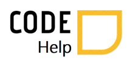

## Code-Help

  
  

Is an institutional application used to schedule appointments between Junior, Full and Senior coders of the same company, in order to provide remote technical appointment scheduling, with remote assistance aiming at the concurrent socialization of company members with newly hired junior programmers and who need help.

## Status of the project

This project is currently under development. Users can schedule appointments based on coder availability.

## Project Screen Shots

PENDENTE

## Installation and Setup Instructions

Clone down this repository. You will need `node` and `npm` installed globally on your machine.  

Installation:

`npm install`  

To Run Test Suite:  

`npm test`  

To Start Server:

`npm start`  

To Visit App:

`localhost:3000/home`  

## Reflection

This was a 2 week long project built during my Winter Holidays at FactoriaF5. Project goals included using technologies learned up until this point and familiarizing myself with PHP using MVC. I started this process by using the `create-react-app` boilerplate, then adding `react-router` and finally `axios` for comunicating with the server repository. One of the main challenges I ran into was Authentication. The technologies implemented in this project are React, React-Router, Axios and a significant JSX. I chose to use the `create-react-app` boilerplate to minimize initial setup.
